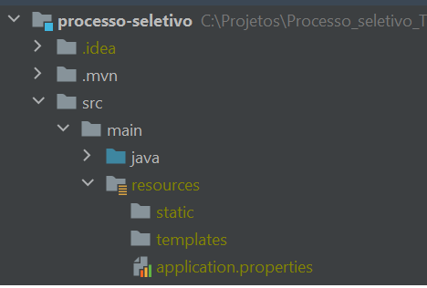
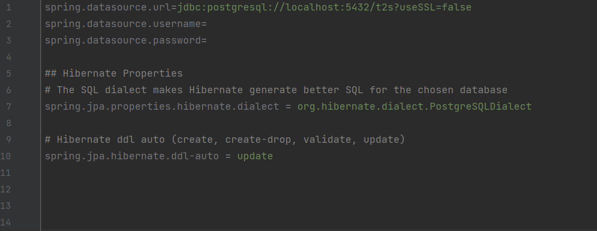

### Back-end

Observação: Utilizando o IntelliJ todas as dependências serão baixadas automaticamente.

Necessário ter o arquivo application.properties para conexão com o banco de dados, conforme o caminho abaixo:

Além da representação da imagem abaixo será preciso por seu username e password do banco, além caso não crie o banco de dados como t2s troca esse nome na primeira linha para o nome do banco de dados que for criado.

